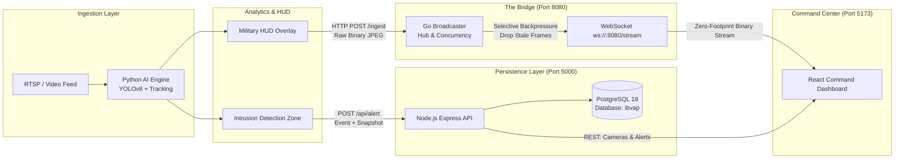

# IBVAP - Decoupled Military Surveillance Platform
**Smart India Hackathon (SIH) - Team TensorTribe**

IBVAP is a decoupled military surveillance architecture designed to eliminate monolithic failure points, tactical network degradation, and vendor lock-in. By isolating heavy AI inference from network distribution, computational spikes do not throttle frame ingestion or client delivery.

---

## 🏗️ System Architecture



---

## ⚡ Core Microservices

| Service | Technology | Port | Key Endpoints / Role |
| :--- | :--- | :--- | :--- |
| **Go Video Broadcaster** | Go 1.24, Gorilla WebSocket | `8080` | `POST /ingest`, `ws://localhost:8080/stream` (Selective Backpressure) |
| **Python AI Engine** | Python 3.13, YOLOv8, OpenCV, FastAPI | `8000` | `POST /cameras/{id}/start`, automated frame annotation & alert dispatch |
| **Node.js API & Database** | Node 24, Express, PostgreSQL | `5000` | `/api/auth`, `/api/camera`, `/api/alert` (PostgreSQL DB logs) |
| **React Frontend** | React 19, Vite, HTML5 Canvas/Img | `5173` | Real-time live browser feed with low-latency binary rendering |

---

## 🚀 Quick Start (Single Command)

To spin up all microservices with one command:

```powershell
.\start_ibvap.ps1
```

To stop all running microservices:

```powershell
.\stop_ibvap.ps1
```

## Free Deployment

For the free setup using Render Static Site, Supabase PostgreSQL, and a local Node/Python backend exposed through Cloudflare Tunnel, see [FREE_DEPLOYMENT.md](FREE_DEPLOYMENT.md).

---

## 🌐 Live Access URLs

- **Command Center Dashboard:** [http://localhost:5173](http://localhost:5173)
- **Go Broadcaster WebSocket:** `ws://localhost:8080/stream`
- **Go Ingestion API:** `POST http://localhost:8080/ingest`
- **Node.js REST API:** [http://localhost:5000/api](http://localhost:5000/api)
- **Python AI Health & Endpoints:** [http://localhost:8000](http://localhost:8000)

# React + Vite

This template provides a minimal setup to get React working in Vite with HMR and some ESLint rules.

Currently, two official plugins are available:

- [@vitejs/plugin-react](https://github.com/vitejs/vite-plugin-react/blob/main/packages/plugin-react) uses [Oxc](https://oxc.rs)
- [@vitejs/plugin-react-swc](https://github.com/vitejs/vite-plugin-react/blob/main/packages/plugin-react-swc) uses [SWC](https://swc.rs/)

## React Compiler

The React Compiler is not enabled on this template because of its impact on dev & build performances. To add it, see [this documentation](https://react.dev/learn/react-compiler/installation).

## Expanding the ESLint configuration

If you are developing a production application, we recommend using TypeScript with type-aware lint rules enabled. Check out the [TS template](https://github.com/vitejs/vite/tree/main/packages/create-vite/template-react-ts) for information on how to integrate TypeScript and [`typescript-eslint`](https://typescript-eslint.io) in your project.
